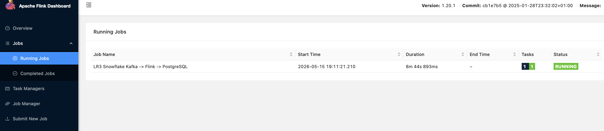
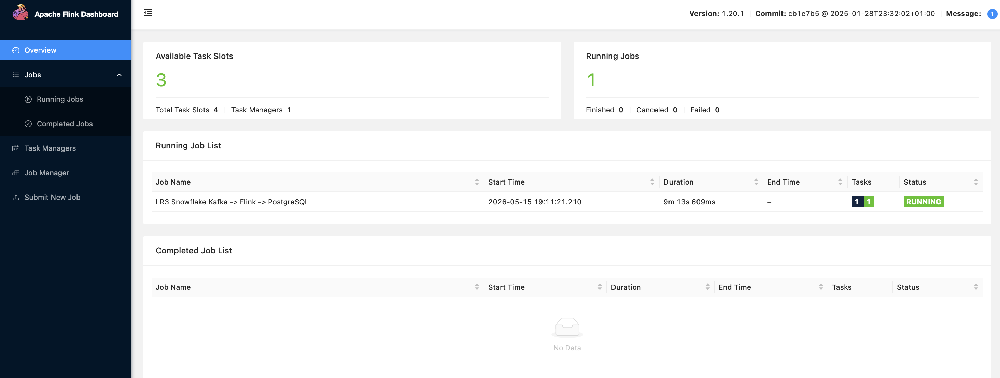

# BigDataFlink

**Лабораторная работа №3** — Потоковая обработка данных с помощью Apache Flink, Kafka и PostgreSQL.

Реализован сквозной streaming ETL-пайплайн:

```
CSV-файлы → Python-producer → Kafka → Apache Flink → PostgreSQL (Snowflake-схема)
```


## Цель работы

Реализовать потоковый ETL-пайплайн, который:

1. **Читает** строки из CSV-файлов с данными о продажах зоотоваров;
2. **Преобразует** каждую строку в JSON и отправляет в Apache Kafka;
3. **Читает** поток из Kafka в Apache Flink в режиме реального времени;
4. **Раскладывает** данные в аналитическую модель типа **Snowflake** (звезда с расширенными измерениями) в PostgreSQL.

---


```
┌──────────────┐     ┌──────────────┐     ┌──────────────┐     ┌──────────────────┐
│  CSV-файлы   │────▶│   Producer   │────▶│    Kafka     │────▶│   Apache Flink   │
│  (10 шт.)    │     │  (Python)    │     │  topic:      │     │  (Streaming)     │
│              │     │  producer.py │     │ petshop.     │     │  PetShopStreaming│
│              │     │              │     │ sales.raw    │     │  Job.java        │
└──────────────┘     └──────────────┘     └──────────────┘     └────────┬─────────┘
                                                                        │
                                                                        ▼
                                                               ┌──────────────────┐
                                                               │   PostgreSQL     │
                                                               │  Snowflake-схема │
                                                               │  12 таблиц       │
                                                               └──────────────────┘
```

Все компоненты запускаются в Docker-контейнерах, оркестрируемых через [`docker-compose.yml`](docker-compose.yml).


##  Компоненты системы

### 1. Producer (Python)

Python-приложение в директории [`producer/`](producer/), которое:

- читает все CSV-файлы из директории [`data/`](data/);
- корректно обрабатывает многострочные поля (в частности `product_description`);
- добавляет в каждое сообщение поле `source_file` — имя исходного файла;
- отправляет каждую строку как отдельный JSON в Kafka topic `petshop.sales.raw`;
- использует библиотеку `kafka-python-ng` с подтверждением `acks=all` и retry-логикой;
- ожидает готовности Kafka до 30 попыток (по 5 секунд).

**Ключевые файлы:**
- [`producer/producer.py`](producer/producer.py) — основной код
- [`producer/Dockerfile`](producer/Dockerfile) — образ на базе `python:3.12-slim`
- [`producer/requirements.txt`](producer/requirements.txt) — зависимости

### 2. Kafka

Брокер сообщений Apache Kafka 3.9.2 в режиме KRaft (без ZooKeeper). Используется для надёжной буферизации и доставки JSON-сообщений от продюсера к Flink.

- Topic: `petshop.sales.raw`
- Партиций: 1 (репликация отключена для лабораторной среды)
- Порт с хоста: `9094`
- Внутренний порт: `19092`

### 3. Apache Flink

Flink-кластер версии 1.20.1 (Java 17) состоит из двух компонентов:

- **JobManager** — координатор, принимает и распределяет задачи, UI на порту `8081`;
- **TaskManager** — исполнитель, 4 слота задач.

Flink-приложение [`PetShopStreamingJob.java`](flink-job/src/main/java/ru/bdsnowflake/lab3/PetShopStreamingJob.java) в streaming-режиме:

- читает JSON из Kafka;
- десериализует в [`RawSaleEvent`](flink-job/src/main/java/ru/bdsnowflake/lab3/RawSaleEvent.java);
- разбивает на 12 параллельных потоков (11 измерений + 1 факт);
- каждый поток пишет данные в соответствующую таблицу PostgreSQL через `upsert` (INSERT ... ON CONFLICT DO UPDATE).

### 4. PostgreSQL

PostgreSQL с предсозданной Snowflake-схемой из 12 таблиц.

- Инициализация: [`postgres/init/01_schema.sql`](postgres/init/01_schema.sql) монтируется в `/docker-entrypoint-initdb.d/`
- Проверки: [`postgres/checks/01_checks.sql`](postgres/checks/01_checks.sql) — 20 аналитических и проверочных запросов

---

##  Модель данных (Snowflake-схема)

Используется **Snowflake-схема** 

### Таблицы измерений

| Таблица | Назначение | Ключ |
|---------|-----------|------|
| [`dim_customer`](postgres/init/01_schema.sql#L6) | Покупатель (имя, email, страна, возраст) | `customer_key` (MD5-хеш) |
| [`dim_pet_type`](postgres/init/01_schema.sql#L18) | Тип питомца (собака, кошка и т.д.) | `pet_type_key` (MD5-хеш) |
| [`dim_pet_breed`](postgres/init/01_schema.sql#L24) | Порода питомца + категория | `pet_breed_key` (MD5-хеш) |
| [`dim_pet`](postgres/init/01_schema.sql#L31) | Питомец (ссылается на тип и породу) | `pet_key` (MD5-хеш) |
| [`dim_seller`](postgres/init/01_schema.sql#L40) | Продавец (имя, email, страна) | `seller_key` (MD5-хеш) |
| [`dim_category`](postgres/init/01_schema.sql#L51) | Категория товара | `category_key` (MD5-хеш) |
| [`dim_brand`](postgres/init/01_schema.sql#L57) | Бренд товара | `brand_key` (MD5-хеш) |
| [`dim_product`](postgres/init/01_schema.sql#L63) | Товар (ссылается на категорию и бренд) | `product_key` (MD5-хеш) |
| [`dim_location`](postgres/init/01_schema.sql#L83) | Локация магазина (город, штат, страна) | `location_key` (MD5-хеш) |
| [`dim_store`](postgres/init/01_schema.sql#L92) | Магазин (ссылается на локацию) | `store_key` (MD5-хеш) |
| [`dim_supplier`](postgres/init/01_schema.sql#L101) | Поставщик | `supplier_key` (MD5-хеш) |

### Таблица фактов

| Таблица | Назначение | Ключ |
|---------|-----------|------|
| [`fact_sales`](postgres/init/01_schema.sql#L113) | Продажи (ссылается на все измерения) | `sale_key` (MD5-хеш) |

### Схема связей

```
dim_customer ──┐
               ├── dim_pet ── dim_pet_type
               │            └── dim_pet_breed
               │
dim_seller ────┤
               │
dim_product ───┤── dim_category
               │   └── dim_brand
               │
dim_store ─────┼── dim_location
               │
dim_supplier ──┘
               │
fact_sales ────┼── (customer_key, pet_key, seller_key, product_key, store_key, supplier_key)
```

**Особенность:** так как поток идёт из Kafka и данные приходят непрерывно, в качестве первичных ключей используются **стабильные текстовые ключи**. 
---

##  Параметры сервисов

### PostgreSQL

| Параметр | Значение |
|----------|----------|
| Host | `localhost` |
| Port | `5436` |
| Database | `pet_shop` |
| User | `pet_user` |
| Password | `pet_password` |
| JDBC URL (внутри сети) | `jdbc:postgresql://postgres:5432/pet_shop` |

### Kafka

| Параметр | Значение |
|----------|----------|
| Bootstrap (внутренний) | `kafka:19092` |
| Bootstrap (с хоста) | `localhost:9094` |
| Topic | `petshop.sales.raw` |

### Flink

| Параметр | Значение |
|----------|----------|
| Flink UI | [http://localhost:8081](http://localhost:8081) |
| Версия | 1.20.1 (Scala 2.12, Java 17) |
| Слотов TaskManager | 4 |
| Checkpoint interval | 10 секунд |

---

##  Требования

- **Docker** (версия 24+)
- **Docker Compose** (V2 — `docker compose` или классический `docker-compose`)
- **bash** (для скриптов)
- **Порт 5436** (PostgreSQL), **9094** (Kafka), **8081** (Flink UI) — должны быть свободны

> Maven **не требуется** — сборка Flink job выполняется в Docker-контейнере.

---

##  Как запустить

Все команды выполняются из **каталога `lab3/`** (рядом с [`docker-compose.yml`](docker-compose.yml)), а не из корня монорепозитория `BDSnowflake/`.

```bash
cd lab3
```

Скрипты в [`scripts/`](scripts/) сами выбирают между `docker compose` (Compose V2) и `docker-compose` (классический бинарник). В инструкциях ниже используется `docker compose`; если у вас только `docker-compose`, замените соответственно.

### 1. Сборка Flink job

```bash
chmod +x scripts/*.sh
./scripts/build_flink_job.sh
```

Что происходит:
1. Docker-образ `lab3-flink-build` собирается из [`flink-job/Dockerfile.build`](flink-job/Dockerfile.build) на базе `maven:3.9.9-eclipse-temurin-17`;
2. Внутри контейнера выполняется `mvn -B -DskipTests package` — собирается fat JAR со всеми зависимостями;
3. JAR-файл `lab3-flink-job-1.0.0.jar` копируется в директорию [`flink-job/target/`](flink-job/target/).

### 2. Запуск инфраструктуры

Сервис **`kafka-init`** один раз создаёт топик `petshop.sales.raw` (на случай, если авто‑создание топиков отключено у брокера).

```bash
docker-compose up -d postgres kafka kafka-init jobmanager taskmanager
```

Порядок важен: сервисы запускаются с учётом зависимостей (`depends_on` с `condition: service_healthy`).

После запуска PostgreSQL автоматически:
- создаст базу данных `pet_shop`;
- выполнит скрипт [`postgres/init/01_schema.sql`](postgres/init/01_schema.sql) — создаст 12 таблиц.

Проверить, что всё поднялось:

```bash
docker-compose ps
```

### 3. Отправка данных в Kafka

```bash
./scripts/run_producer.sh
```

Продюсер:
- автоматически пересобирает Docker-образ (флаг `--build`);
- читает все 10 CSV-файлов из [`data/`](data/);
- корректно обрабатывает многострочный `product_description`;
- добавляет в каждое сообщение поле `source_file`;
- отправляет каждую строку как отдельный JSON в Kafka topic `petshop.sales.raw`;
- после отправки всех сообщений завершает работу.

Ожидаемый вывод:
```
Finished sending 10000 messages to topic 'petshop.sales.raw'
```

### 4. Запуск Flink job

```bash
./scripts/submit_flink_job.sh
```

Скрипт:
- подключается к контейнеру `lab3-flink-jobmanager`;
- передаёт переменные окружения для подключения к Kafka и PostgreSQL;
- запускает JAR в detached-режиме (`flink run -d`).

После запуска можно проверить статус job в Flink UI: [http://localhost:8081](http://localhost:8081)


### 5. Проверка результатов

#### Быстрая проверка

```bash
cd lab3
docker exec -i lab3-postgres psql -U pet_user -d pet_shop < postgres/checks/01_checks.sql
```

Скрипт [`postgres/checks/01_checks.sql`](postgres/checks/01_checks.sql) выполняет **17 SQL-проверок** (разделы 1.1–1.3, 2.1–2.10, 3.1–3.4):

**Базовые проверки:**
- количество строк во всех 12 таблицах;
- проверка NULL-ключей в `fact_sales`;
- общая сумма всех продаж.

**Аналитические запросы:**
- топ-10 стран по сумме продаж;
- топ-10 товаров (с категорией и брендом);
- продажи по категориям и брендам;
- продажи по магазинам с локацией;
- средний чек по странам;
- продажи по типам и породам питомцев;
- динамика продаж по месяцам;
- самая дорогая продажа.

**Проверки целостности:**
- дубликаты в `fact_sales` (должно быть 0);
- продажи без даты;
- отрицательные цены/количество;
- распределение по source_file.

#### Ручная проверка

```bash
docker exec -it lab3-postgres psql -U pet_user -d pet_shop
```

Пример запроса:

```sql
SELECT
    c.customer_country,
    p.product_name,
    SUM(f.sale_quantity) AS total_qty,
    ROUND(SUM(f.sale_total_price), 2) AS total_sum
FROM fact_sales f
JOIN dim_customer c ON c.customer_key = f.customer_key
JOIN dim_product p ON p.product_key = f.product_key
GROUP BY c.customer_country, p.product_name
ORDER BY total_sum DESC
LIMIT 10;
```

---

##  Аналитические запросы

В [`postgres/checks/01_checks.sql`](postgres/checks/01_checks.sql) реализованы следующие аналитические витрины:

| № | Запрос |
|---|--------|
| 1 | Топ-10 стран по сумме продаж |
| 2 | Топ-10 товаров (с категорией и брендом) |
| 3 | Продажи по категориям товаров |
| 4 | Продажи по брендам |
| 5 | Продажи по магазинам (с локацией) |
| 6 | Средний чек по странам |
| 7 | Продажи по типам питомцев |
| 8 | Продажи по породам питомцев |
| 9 | Количество продаж по месяцам |
| 10 | Самая дорогая продажа |

---

##  Ожидаемый результат

После прохождения всего пайплайна:

| Метрика | Значение |
|---------|----------|
| Сообщений в Kafka | 10 000 |
| Строк в `fact_sales` | 10 000 |
| Уникальных покупателей (`dim_customer`) | ~2 000 |
| Уникальных товаров (`dim_product`) | ~1 000 |
| Уникальных магазинов (`dim_store`) | ~500 |
| Уникальных поставщиков (`dim_supplier`) | ~500 |
| Повторный запуск | Без дубликатов (upsert) |

---

## Устройство Flink-приложения

Flink-приложение находится в [`flink-job/src/main/java/ru/bdsnowflake/lab3/`](flink-job/src/main/java/ru/bdsnowflake/lab3/).

### Основные классы

| Файл | Назначение |
|------|-----------|
| [`PetShopStreamingJob.java`](flink-job/src/main/java/ru/bdsnowflake/lab3/PetShopStreamingJob.java) | Главный класс — точка входа, настройка пайплайна |
| [`RawSaleEvent.java`](flink-job/src/main/java/ru/bdsnowflake/lab3/RawSaleEvent.java) | POJO для десериализации JSON из Kafka |
| [`SqlStatements.java`](flink-job/src/main/java/ru/bdsnowflake/lab3/SqlStatements.java) | Все SQL-запросы (UPSERT для каждой таблицы) |
| [`Customer.java`](flink-job/src/main/java/ru/bdsnowflake/lab3/Customer.java) | Маппинг RawSaleEvent → dim_customer |
| [`PetType.java`](flink-job/src/main/java/ru/bdsnowflake/lab3/PetType.java) | Маппинг RawSaleEvent → dim_pet_type |
| [`PetBreed.java`](flink-job/src/main/java/ru/bdsnowflake/lab3/PetBreed.java) | Маппинг RawSaleEvent → dim_pet_breed |
| [`Pet.java`](flink-job/src/main/java/ru/bdsnowflake/lab3/Pet.java) | Маппинг RawSaleEvent → dim_pet |
| [`Seller.java`](flink-job/src/main/java/ru/bdsnowflake/lab3/Seller.java) | Маппинг RawSaleEvent → dim_seller |
| [`Category.java`](flink-job/src/main/java/ru/bdsnowflake/lab3/Category.java) | Маппинг RawSaleEvent → dim_category |
| [`Brand.java`](flink-job/src/main/java/ru/bdsnowflake/lab3/Brand.java) | Маппинг RawSaleEvent → dim_brand |
| [`Product.java`](flink-job/src/main/java/ru/bdsnowflake/lab3/Product.java) | Маппинг RawSaleEvent → dim_product |
| [`Location.java`](flink-job/src/main/java/ru/bdsnowflake/lab3/Location.java) | Маппинг RawSaleEvent → dim_location |
| [`Store.java`](flink-job/src/main/java/ru/bdsnowflake/lab3/Store.java) | Маппинг RawSaleEvent → dim_store |
| [`Supplier.java`](flink-job/src/main/java/ru/bdsnowflake/lab3/Supplier.java) | Маппинг RawSaleEvent → dim_supplier |
| [`FactSale.java`](flink-job/src/main/java/ru/bdsnowflake/lab3/FactSale.java) | Маппинг RawSaleEvent → fact_sales |


---

## Демонстрация работы

### Flink UI — Running Jobs


### Flink UI — Job Overview 


